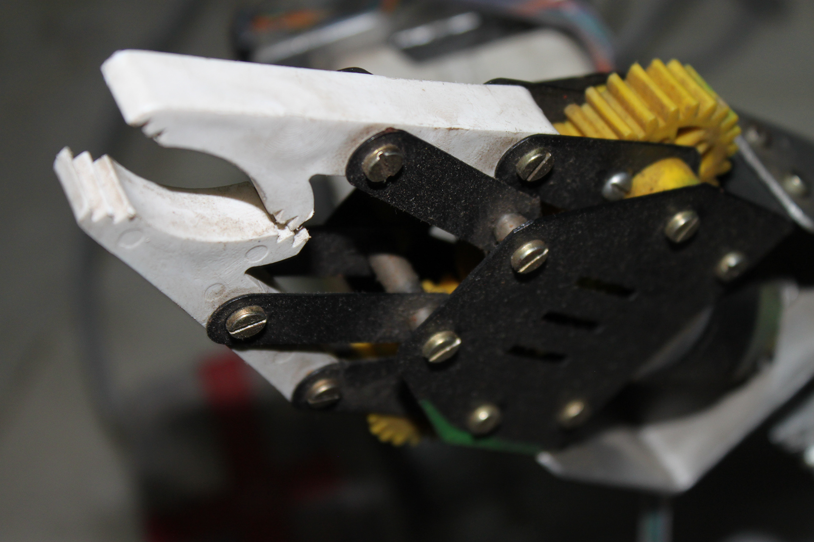
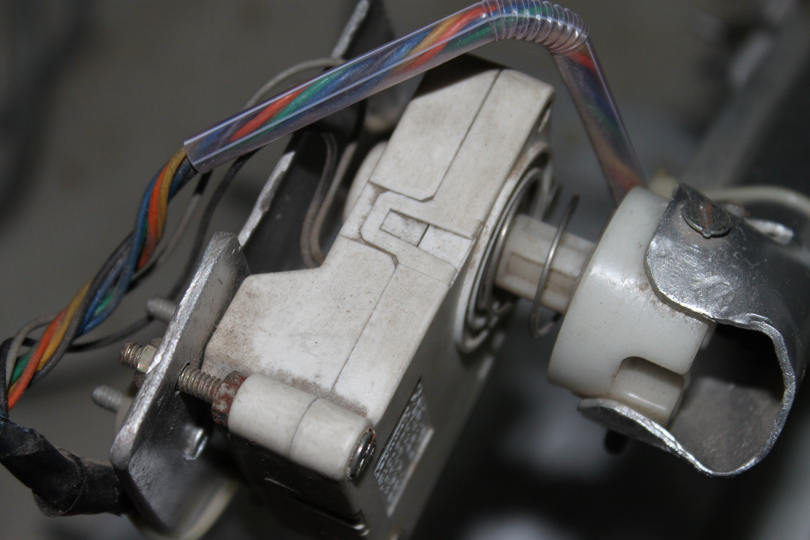
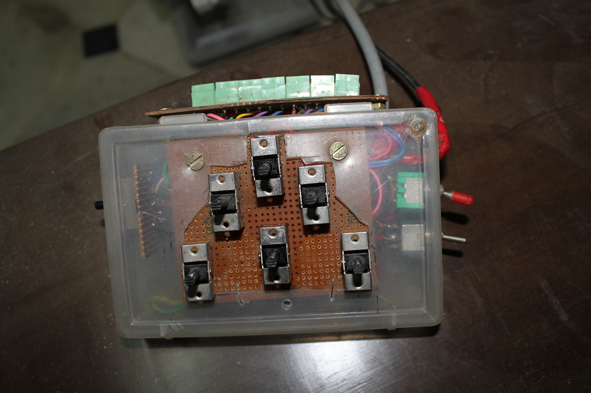
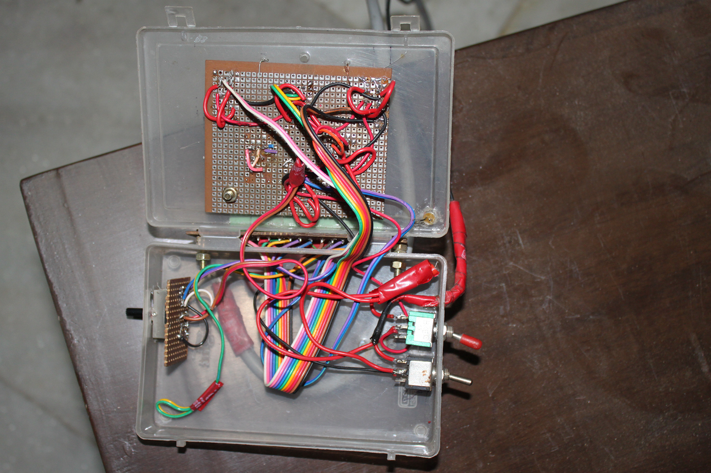

# THM: The Hand Mimic

India, 2011

<iframe title="vimeo-player" src="https://player.vimeo.com/video/148918195?h=88025090dc" width="640" height="360" frameborder="0" allowfullscreen></iframe>

## Why?

The aim for me for this project was to make a robotic arm that could essentially mimic the movements as well as functionality of the human arm, in the most simple way possible. I wanted the project to represent the stereo-typical image that comes to mind when one thinks of robots.

## How?

Instead of using stepper motors which require their own complex circuitry to control, I used locally sourced low RPM, high torque geared DC motors which only require sufficient voltage (12V) applied to them to function.

Manual Control Box (Outside) | Manual Control Box (Inside)
:-------------------------:|:-------------------------:
 | 

The (WIRED) Remote Control for the hand mimic. DPDT (Dual Pole Dual Throw) joystick type switches were used as control surfaces. This allowed me to operate the motors of the robot bi-directionally simply, without the use of any kind of complex motor-drivers or transistor H-bridges.
